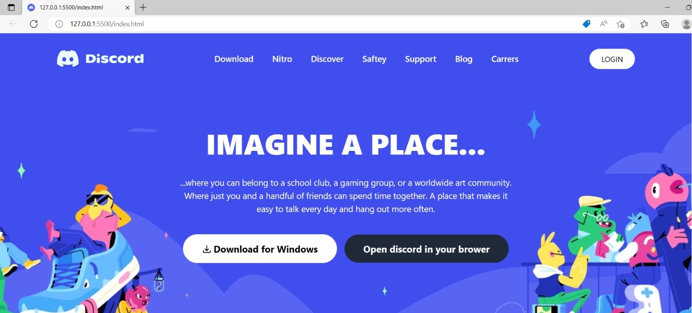
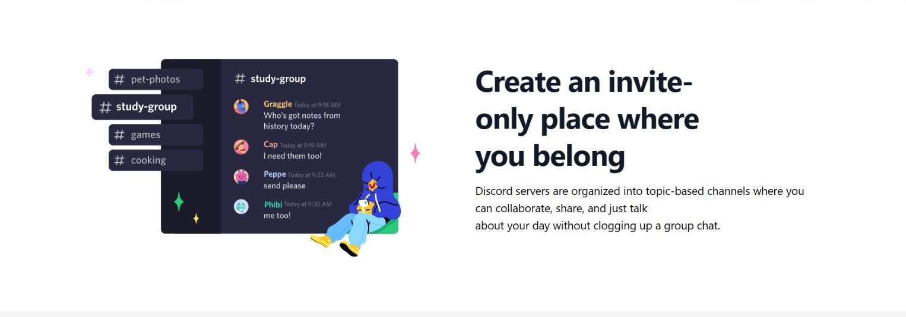
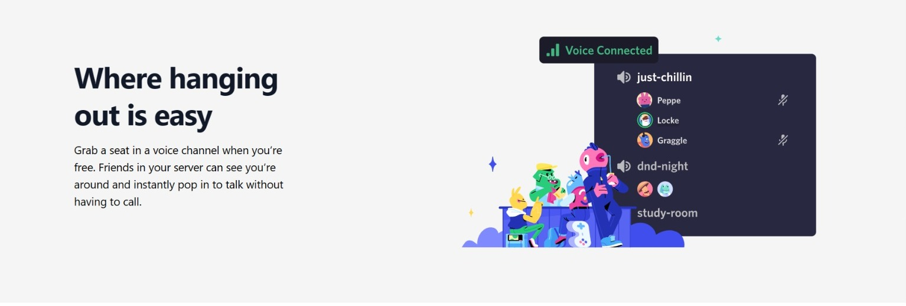
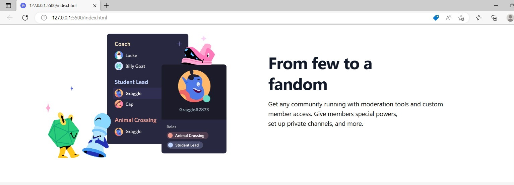
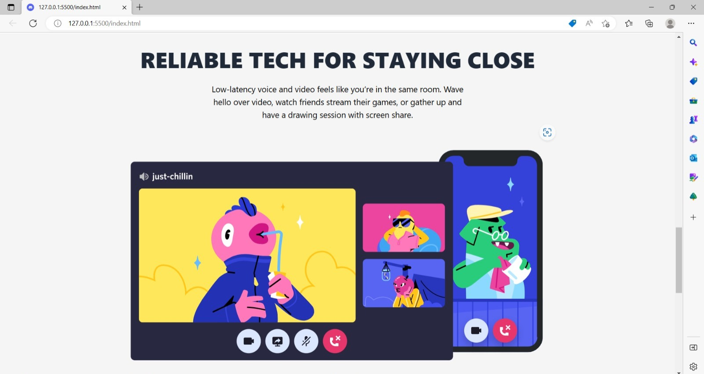
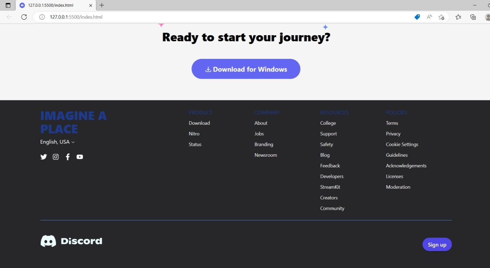

# Assignment-Tailwind Css 
## (Discord Clone Page) 

> In this project, I have used HTML (the Hypertext Markup Language) and Tailwind CSS, which are two of the core technologies for building Web pages. It is a responsive page.

### Screenshot: 

## (video demo)

### As a result of this project, I learn the following:
[LIVE-LINK](https://discord-clone-tailwindapp.netlify.app/)

- [x] learned about Tailwind CSS

#### The duration of the project:8 hour